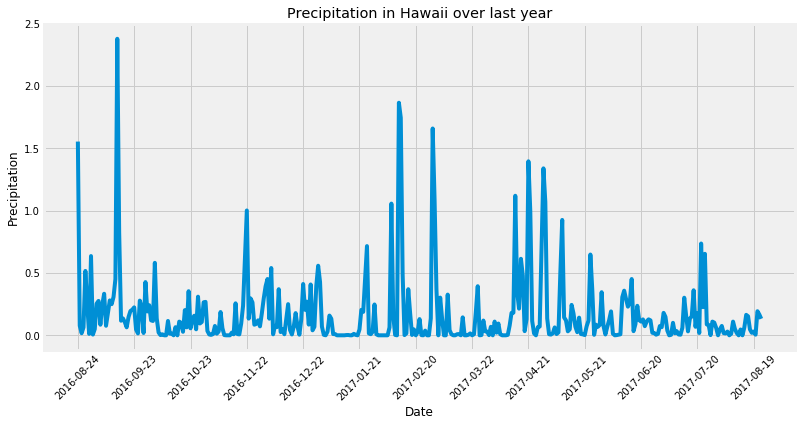
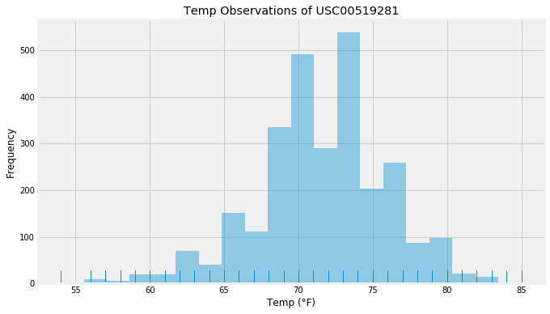
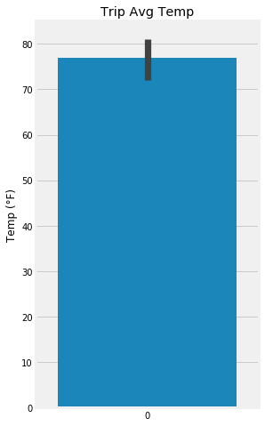
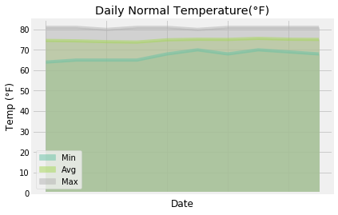

```python

from matplotlib import style
style.use('fivethirtyeight')
import matplotlib.pyplot as plt
import seaborn as sns
```


```python
import numpy as np
import pandas as pd
```


```python
import datetime as dt
```

# Reflect Tables into SQLAlchemy ORM


```python
# Python SQL toolkit and Object Relational Mapper
import sqlalchemy
from sqlalchemy.ext.automap import automap_base
from sqlalchemy.orm import Session
from sqlalchemy import create_engine, func, inspect
```


```python
engine = create_engine("sqlite:///Resources/hawaii.sqlite")
```


```python
# reflect an existing database into a new model
Base = automap_base()
# reflect the tables
Base.prepare(engine, reflect=True)
```


```python
# We can view all of the classes that automap found
Base.classes.keys()
```


    ['measurement', 'station']


```python
# Save references to each table
Measurement = Base.classes.measurement
Station = Base.classes.station
```


```python
# Create our session (link) from Python to the DB
session = Session(engine)
```


```python
#creating an inspector by importing inspect from sqlalchemy
mlist=[]
inspector = inspect(engine)
# inspector.get_table_names()
for c in inspector.get_columns('measurement'):
    mlist.append(f"Measurement.{c['name']}")
    print(c['name'], c["type"])
```

    id INTEGER
    station TEXT
    date TEXT
    prcp FLOAT
    tobs FLOAT


```python
#performing a select * statement with engine.execute to see how the data looks
engine.execute('SELECT * FROM measurement limit 7').fetchall()
```


    [(1, 'USC00519397', '2010-01-01', 0.08, 65.0),
     (2, 'USC00519397', '2010-01-02', 0.0, 63.0),
     (3, 'USC00519397', '2010-01-03', 0.0, 74.0),
     (4, 'USC00519397', '2010-01-04', 0.0, 76.0),
     (5, 'USC00519397', '2010-01-06', None, 73.0),
     (6, 'USC00519397', '2010-01-07', 0.06, 70.0),
     (7, 'USC00519397', '2010-01-08', 0.0, 64.0)]


```python
#using same as above and creating a dataframe to count items. Reason for DF is to show if any Null items exist

test = engine.execute('SELECT * FROM measurement').fetchall()
pd.DataFrame(test).count()
#Note: few items in 3rd column (precipitation) is Null. Consider this in analysis
```


    0    19550
    1    19550
    2    19550
    3    18103
    4    19550
    dtype: int64


```python
# extracting the last date from the date column in measurement table/class
lastdate = session.query(Measurement.date).order_by(Measurement.date)[-1][0]
lastdate = dt.datetime.strptime(lastdate, "%Y-%m-%d")
lastdate.strftime("%Y-%m-%d")
```


    '2017-08-23'


```python
lastyear = dt.datetime.today() - dt.timedelta(days=365)
lastyear.strftime("%Y-%m-%d")
```


    '2017-07-28'


```python
# Design a query to retrieve the last 12 months of precipitation data and plot the results

# Calculate the date 1 year ago from today
firstdate = lastdate - dt.timedelta(days=365)

# Perform a query to retrieve the data and precipitation scores
prcpQRY = session.query(Measurement.date, func.avg(Measurement.prcp)).\
        filter(Measurement.date <= lastdate, Measurement.date >= firstdate).\
        group_by(Measurement.date).all()

# Save the query results as a Pandas DataFrame and set the index to the date column
prcpDF = pd.DataFrame(data = prcpQRY, columns=["date","prcp"])
prcpDF.set_index("date",inplace=True)
prcpDF.head()
```


<div>
<style scoped>
    .dataframe tbody tr th:only-of-type {
        vertical-align: middle;
    }

    .dataframe tbody tr th {
        vertical-align: top;
    }

    .dataframe thead th {
        text-align: right;
    }
</style>
<table border="1" class="dataframe">
  <thead>
    <tr style="text-align: right;">
      <th></th>
      <th>prcp</th>
    </tr>
    <tr>
      <th>date</th>
      <th></th>
    </tr>
  </thead>
  <tbody>
    <tr>
      <th>2016-08-24</th>
      <td>1.555000</td>
    </tr>
    <tr>
      <th>2016-08-25</th>
      <td>0.077143</td>
    </tr>
    <tr>
      <th>2016-08-26</th>
      <td>0.016667</td>
    </tr>
    <tr>
      <th>2016-08-27</th>
      <td>0.064000</td>
    </tr>
    <tr>
      <th>2016-08-28</th>
      <td>0.516667</td>
    </tr>
  </tbody>
</table>
</div>


# Exploratory Climate Analysis


```python
#from matplotlib.ticker import LinearLocator
# Use Pandas Plotting with Matplotlib to plot the data

plt.figure(figsize=(12,6))
x_ticks=prcpDF.index[0::30]
sns.set_style()
plt.plot(prcpDF.index, prcpDF["prcp"])
plt.xticks(x_ticks,x_ticks, visible=True,rotation=45)
plt.title(f"Precipitation in Hawaii over last year")
plt.ylabel("Precipitation")
plt.xlabel("Date")
plt.show()
```





```python
# Use Pandas to calcualte the summary statistics for the precipitation data
prcpDF.describe()
```


<div>
<style scoped>
    .dataframe tbody tr th:only-of-type {
        vertical-align: middle;
    }

    .dataframe tbody tr th {
        vertical-align: top;
    }

    .dataframe thead th {
        text-align: right;
    }
</style>
<table border="1" class="dataframe">
  <thead>
    <tr style="text-align: right;">
      <th></th>
      <th>prcp</th>
    </tr>
  </thead>
  <tbody>
    <tr>
      <th>count</th>
      <td>365.000000</td>
    </tr>
    <tr>
      <th>mean</th>
      <td>0.169987</td>
    </tr>
    <tr>
      <th>std</th>
      <td>0.295722</td>
    </tr>
    <tr>
      <th>min</th>
      <td>0.000000</td>
    </tr>
    <tr>
      <th>25%</th>
      <td>0.008571</td>
    </tr>
    <tr>
      <th>50%</th>
      <td>0.070000</td>
    </tr>
    <tr>
      <th>75%</th>
      <td>0.191667</td>
    </tr>
    <tr>
      <th>max</th>
      <td>2.380000</td>
    </tr>
  </tbody>
</table>
</div>


```python
# How many stations are available in this dataset?
session.query(Measurement.station).distinct().count()
```


    9


```python
# What are the most active stations?
# List the stations and the counts in descending order.
stationActivity = session.query(Measurement.station, func.count(Measurement.tobs)).\
    group_by(Measurement.station).\
    order_by(func.count(Measurement.tobs).desc()).all()
    
stationActivity
```


    [('USC00519281', 2772),
     ('USC00519397', 2724),
     ('USC00513117', 2709),
     ('USC00519523', 2669),
     ('USC00516128', 2612),
     ('USC00514830', 2202),
     ('USC00511918', 1979),
     ('USC00517948', 1372),
     ('USC00518838', 511)]


```python
# Using the station id from the previous query, calculate the lowest temperature recorded, 
# highest temperature recorded, and average temperature most active station?
mostActive = stationActivity[0][0]
lowestTemp = session.query(func.min(Measurement.tobs)).filter(Measurement.station==mostActive).all()[0]
highestTemp = session.query(func.max(Measurement.tobs)).filter(Measurement.station==mostActive).all()[0]
averageTemp = session.query(func.avg(Measurement.tobs)).filter(Measurement.station==mostActive).all()[0]

MostActiveDF = pd.DataFrame({
                "Station":mostActive,
                "Lowest Temp":lowestTemp,
                "Highest Temp":highestTemp,
                "Avg Temp":averageTemp,
})

MostActiveDF = MostActiveDF[["Station","Lowest Temp","Highest Temp","Avg Temp"]]
MostActiveDF
```


<div>
<style scoped>
    .dataframe tbody tr th:only-of-type {
        vertical-align: middle;
    }

    .dataframe tbody tr th {
        vertical-align: top;
    }

    .dataframe thead th {
        text-align: right;
    }
</style>
<table border="1" class="dataframe">
  <thead>
    <tr style="text-align: right;">
      <th></th>
      <th>Station</th>
      <th>Lowest Temp</th>
      <th>Highest Temp</th>
      <th>Avg Temp</th>
    </tr>
  </thead>
  <tbody>
    <tr>
      <th>0</th>
      <td>USC00519281</td>
      <td>54.0</td>
      <td>85.0</td>
      <td>71.663781</td>
    </tr>
  </tbody>
</table>
</div>


```python

# Choose the station with the highest number of temperature observations.
# Query the last 12 months of temperature observation data for this station and plot the results as a histogram
MostTempObs = session.query(Measurement.tobs).filter(Measurement.station==mostActive).all()
plt.figure(figsize=(10,6))
sns.distplot(MostTempObs, bins=20, kde=False, rug=True);
plt.title(f"Temp Observations of {mostActive}")
plt.ylabel("Frequency")
plt.xlabel("Temp (°F)")
plt.show()
```





```python
# Write a function called `calc_temps` that will accept start date and end date in the format '%Y-%m-%d' 
# and return the minimum, average, and maximum temperatures for that range of dates
# startdate = input("Enter start date(Y-M-D): ")
# enddate = input("Enter end date(Y-M-D): ")

def calc_temps(start_date, end_date):

    datefilter = session.query(func.min(Measurement.tobs), func.avg(Measurement.tobs), func.max(Measurement.tobs)).\
        filter(Measurement.date >= start_date).filter(Measurement.date <= end_date).all()
        
    TMIN = datefilter[0][0]
    TAVG = round(datefilter[0][1],1)
    TMAX = datefilter[0][2]
    
    print(f"\nFor the dates entered {start_date.strftime('%Y-%m-%d')} to {end_date.strftime('%Y-%m-%d')}, \nTemp(°F) is as follows:\n   Min Temp: {TMIN}\n   Avg Temp: {TAVG}\n   Max Temp: {TMAX}")
    return TMIN, TAVG, TMAX
# calc_temps(startdate, enddate)
```


```python
print(f"Please pick dates before {lastdate}")
i = 0
while i == 0:
    vacationStart = input("Please enter a start date for vacation (Y-M-D): ")
    vacationEnd = input("Please enter a end date for vacation (Y-M-D): ")
    vacationStart = dt.datetime.strptime(vacationStart, "%Y-%m-%d")
    vacationEnd = dt.datetime.strptime(vacationEnd, "%Y-%m-%d")

    delta = vacationEnd-vacationStart
    delta = delta.days+1

    if delta < 3 or delta >15:
        print("Not in vacation range, which is 3 to 15 days please redo\n")
        i = 0
    else:
        i = 1

```

    Please pick dates before 2017-08-23 00:00:00
    Please enter a start date for vacation (Y-M-D): 2017-6-1
    Please enter a end date for vacation (Y-M-D): 2017-6-10


```python
# Use your previous function `calc_temps` to calculate the tmin, tavg, and tmax 
# for your trip using the previous year's data for those same dates.
TempInfo = calc_temps(vacationStart, vacationEnd)
```

    
    For the dates entered 2017-06-01 to 2017-06-10, 
    Temp(°F) is as follows:
       Min Temp: 72.0
       Avg Temp: 77.5
       Max Temp: 81.0


```python
# Plot the results from your previous query as a bar chart. 
plt.figure(figsize=(4,8))
sns.barplot(data=TempInfo)
plt.title("Trip Avg Temp")
plt.ylabel("Temp (°F)")
plt.show()
# Use "Trip Avg Temp" as your Title
# Use the average temperature for the y value
# Use the peak-to-peak (tmax-tmin) value as the y error bar (yerr)

```





```python
# Calculate the rainfall per weather station for your trip dates using the previous year's matching dates.
# Sort this in descending order by precipitation amount and list the station, name, latitude, longitude, and elevation

stationQRY = session.query(Measurement.station, func.avg(Measurement.prcp), Station.name, Station.latitude, Station.longitude, Station.elevation).\
        filter(Measurement.date <= vacationEnd.strftime('%Y-%m-%d'), \
               Measurement.date >= vacationStart.strftime('%Y-%m-%d'), \
              Measurement.station == Station.station).\
        group_by(Measurement.station).order_by(func.avg(Measurement.prcp).desc()).all()
stationQRY = pd.DataFrame(data=stationQRY, columns=["Station","Avg Prcp", "Name", "Latitude", "Longitude", "Elevation"])
stationQRY
```


<div>
<style scoped>
    .dataframe tbody tr th:only-of-type {
        vertical-align: middle;
    }

    .dataframe tbody tr th {
        vertical-align: top;
    }

    .dataframe thead th {
        text-align: right;
    }
</style>
<table border="1" class="dataframe">
  <thead>
    <tr style="text-align: right;">
      <th></th>
      <th>Station</th>
      <th>Avg Prcp</th>
      <th>Name</th>
      <th>Latitude</th>
      <th>Longitude</th>
      <th>Elevation</th>
    </tr>
  </thead>
  <tbody>
    <tr>
      <th>0</th>
      <td>USC00516128</td>
      <td>0.141667</td>
      <td>MANOA LYON ARBO 785.2, HI US</td>
      <td>21.33310</td>
      <td>-157.80250</td>
      <td>152.4</td>
    </tr>
    <tr>
      <th>1</th>
      <td>USC00519281</td>
      <td>0.099000</td>
      <td>WAIHEE 837.5, HI US</td>
      <td>21.45167</td>
      <td>-157.84889</td>
      <td>32.9</td>
    </tr>
    <tr>
      <th>2</th>
      <td>USC00514830</td>
      <td>0.092000</td>
      <td>KUALOA RANCH HEADQUARTERS 886.9, HI US</td>
      <td>21.52130</td>
      <td>-157.83740</td>
      <td>7.0</td>
    </tr>
    <tr>
      <th>3</th>
      <td>USC00513117</td>
      <td>0.073000</td>
      <td>KANEOHE 838.1, HI US</td>
      <td>21.42340</td>
      <td>-157.80150</td>
      <td>14.6</td>
    </tr>
    <tr>
      <th>4</th>
      <td>USC00519523</td>
      <td>0.028000</td>
      <td>WAIMANALO EXPERIMENTAL FARM, HI US</td>
      <td>21.33556</td>
      <td>-157.71139</td>
      <td>19.5</td>
    </tr>
    <tr>
      <th>5</th>
      <td>USC00519397</td>
      <td>0.006000</td>
      <td>WAIKIKI 717.2, HI US</td>
      <td>21.27160</td>
      <td>-157.81680</td>
      <td>3.0</td>
    </tr>
    <tr>
      <th>6</th>
      <td>USC00517948</td>
      <td>NaN</td>
      <td>PEARL CITY, HI US</td>
      <td>21.39340</td>
      <td>-157.97510</td>
      <td>11.9</td>
    </tr>
  </tbody>
</table>
</div>


## Optional Challenge Assignment


```python
# Create a query that will calculate the daily normals 
# (i.e. the averages for tmin, tmax, and tavg for all historic data matching a specific month and day)
vacayInfo = []
def daily_normals(date):
    
    sel = [func.min(Measurement.tobs), func.avg(Measurement.tobs), func.max(Measurement.tobs)]
    return session.query(*sel).filter(func.strftime("%m-%d", Measurement.date) == date).all()
    

```


```python
# calculate the daily normals for your trip
# push each tuple of calculations into a list called `normals`

# Set the start and end date of the trip

# Use the start and end date to create a range of dates

# Stip off the year and save a list of %m-%d strings

# Loop through the list of %m-%d strings and calculate the normals for each date
for x in range(delta):
    date = vacationStart+dt.timedelta(x)
    date = date.strftime("%m-%d")
    normals = daily_normals(date)
    
    normalInfo = {"Date":date ,"Min":normals[0][0], "Avg":round(normals[0][1],1), "Max":normals[0][2]}
    vacayInfo.append(normalInfo)

vacayDF = pd.DataFrame(vacayInfo)
vacayDF = vacayDF[["Date","Min","Avg","Max"]]
vacayDF.set_index("Date",inplace=True)
vacayDF.head()
```


<div>
<style scoped>
    .dataframe tbody tr th:only-of-type {
        vertical-align: middle;
    }

    .dataframe tbody tr th {
        vertical-align: top;
    }

    .dataframe thead th {
        text-align: right;
    }
</style>
<table border="1" class="dataframe">
  <thead>
    <tr style="text-align: right;">
      <th></th>
      <th>Min</th>
      <th>Avg</th>
      <th>Max</th>
    </tr>
    <tr>
      <th>Date</th>
      <th></th>
      <th></th>
      <th></th>
    </tr>
  </thead>
  <tbody>
    <tr>
      <th>06-01</th>
      <td>64.0</td>
      <td>74.6</td>
      <td>81.0</td>
    </tr>
    <tr>
      <th>06-02</th>
      <td>65.0</td>
      <td>74.4</td>
      <td>81.0</td>
    </tr>
    <tr>
      <th>06-03</th>
      <td>65.0</td>
      <td>74.0</td>
      <td>80.0</td>
    </tr>
    <tr>
      <th>06-04</th>
      <td>65.0</td>
      <td>73.8</td>
      <td>81.0</td>
    </tr>
    <tr>
      <th>06-05</th>
      <td>68.0</td>
      <td>74.9</td>
      <td>81.0</td>
    </tr>
  </tbody>
</table>
</div>


```python
# Plot the daily normals as an area plot with `stacked=False`
vacayDF.plot(kind='area', stacked=False, alpha=.5,  colormap='Set2')
             
plt.title(f"Daily Normal Temperature(°F)")
plt.ylabel("Temp (°F)")
plt.show()
```




